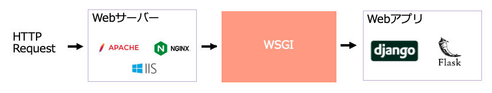
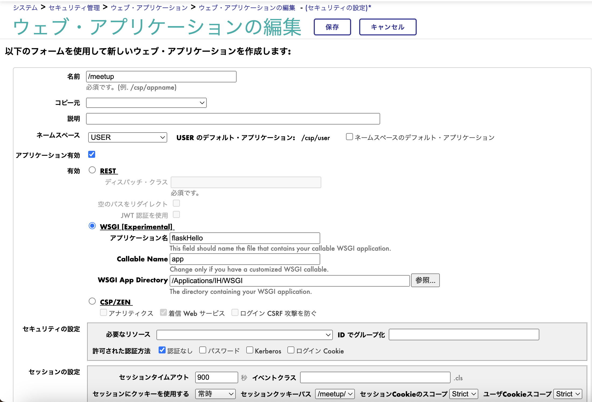
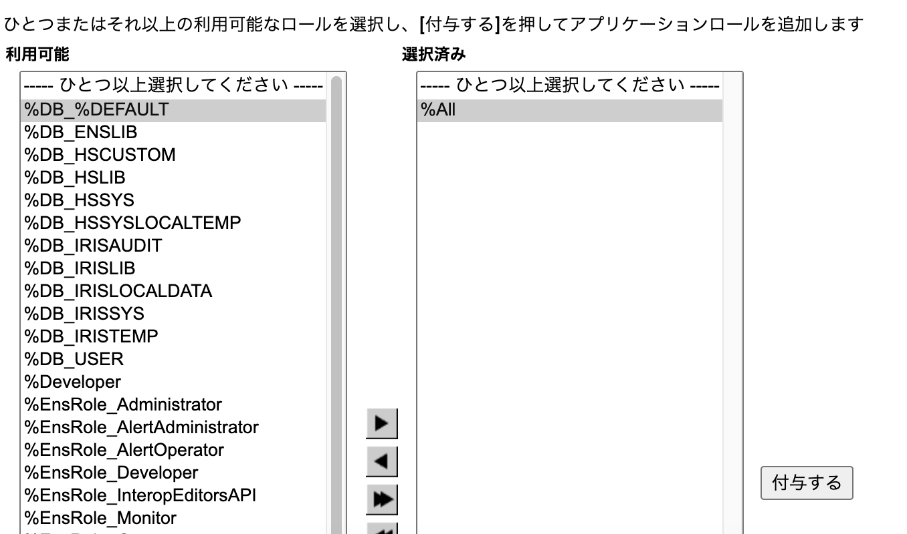
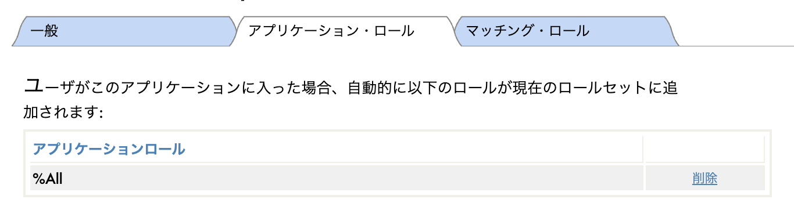

# WSGI-FLASK

IRIS 2024.1 には、Pytyhon WSGIに準拠するWebアプリケーションを作成・管理する機能が含まれています。
このハンズオンでは、WSGIに準拠したWebフレームワークを利用して、簡単なWebアプリケーションの作成を体験します。

# 目次などなど

- [1章などなど](#1章などなど)
- [2章などなど](#2章などなど)


## 1. WSGI

WSGIはWeb Server  Gateway Interfaceの略で、ウィズギー　もしくは、ウィスキーと発音します。
WSGIは、WebサーバーとPythonアプリケーション間の通信を可能にし、Webアプリケーションの開発を容易にします。


この図は、Webアプリケーションの簡単なアーキテクチャーを示しています。
WebサーバーはHTTPリクエストを受けとり、適切なリソースを提供する役割があります。
Webアプリは、動的なコンテンツを提供したり、様々な機能を提供します。Pythonでは、djangoやFlaskといったWebフレームワークを利用してWebアプリが開発されることが多いです。

通信の流れとしては、
WebブラウザからHTTP requestが発生し、Webサーバーに到着します。
WebサーバーはWebアプリの機能を呼び出したいのですが、WebサーバーにはWebアプリを直接呼び出すことができません。このとき、Webアプリの機能を呼び出すのが中間サーバーである、WSGIの役割となります。

### IRISでWSGI準拠のWebアプリを管理可能に
IRIS 2024.1では、DjangoやFlaskといったWSGIに準拠するWebアプリケーションをローンチ・管理することが可能になりました。IRISに配置されたWebアプリに関して、IRISがWSGIサーバーとして振る舞うため、別途WSGIサーバーを用意する必要がありません。


## 2. WSGI準拠のWebフレームワーク FLASK

Flaskは、WSGIに準拠した Python Webフレームワークです。シンプルな設計でありながら、多くの拡張機能により、Webアプリケーションに必要な機能を追加できるのが特徴で、人気のあるWebフレームワークの一つです。

### Flaskのインストール

pipを利用して、flaskをインストールします

        (要確認)python3 -m pip install --target /(IRISインストールディレクトリ)/mgr/python flask
### インストールの確認

IRIS ターミナルから:py コマンドで Embedded Python用のシェルを起動し、flaskがインストールされていることを確認します。

        USER>:py
        >>> import flask
        (エラーが起きないことを確認)

### Hello Flask

下記をエディタで作成し、helloFlask.pyとして保存してください。

```Python:helloFlask.py
from flask import Flask
app = Flask(__name__)

@app.route('/')
def hello():
    name = "Hello MeetUp!"
    return name

@app.route('/good')
def good():
    name = "Good"
    return name

if __name__ == "__main__":
    app.run(debug=True)
```

### irispythonでFlaskを実行
作成したコードを実行します。

    /(IRISインストールディレクトリ))/bin/irispython flaskHello.py

#### ブラウザで確認

Webブラウザでで動作確認を行います。Flaskのデフォルトのポートは5000です。

・localhost:5000にアクセスし、"Hello MeetUp!"と表示される。

・localhost:5000/good とアクセスすると、"Good"と表示される。

こうしてWebブラウザからアクセスできるのは、Flaskに、開発・テスト用の簡易Webサーバーが内包されているためです。

## 3. IRISへWebアプリをデプロイ

IRISに今作成したWebアプリをデプロイしてみましょう。

まず、さきほど作成したflaskHello.pyを、IRISがアクセスできる場所に配置します。

例： /(IRISインストールディレクトリ)/WSGI/flaskHello.py 

IRIS管理ポータルより、
[システム管理] -> [セキュリティ] -> [アプリケーション] -> [ウェブアプリケーション]
-> [新しいWebアプリケーション] を選択します。

下記を入力します。

- [名前] /meetup
- [ネームスペース] USER
- [アプリケーション有効] チェック
- [有効] WSGIを選択
- [アプリケーション名] flaskHello
  - flaskのファイル名から".py"を取り除いた部分
- [Callable Name] app  
  - `app = Flask(__name__)` の変数名を指定
- [WSGI App Directory] (flaskHello.pyを配置したディレクトリを指定)



アプリケーション・ロール タブにて、ロールを選択します。
ここでは、%All を選択し、付与する　をクリックします。






※ 実運用では必要な権限のみを付与してください。

### Webブラウザで確認

Webブラウザで動作確認します。

・(サーバーURL)/meetup にアクセスし、"Hello MeetUp!" と表示されることを確認します。

・(サーバーURL)/meetup/good にアクセスし、"Good" と表示されることを確認します。


## 4. データベースを活用したWebアプリを作成

## 5. 応用編的な


