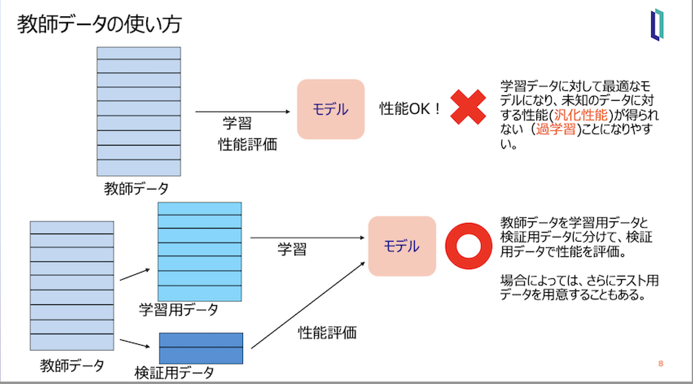

# 機械学習で手書き数字の識別に挑戦
このワークショップでは、MNISTが提供している手書き数字の画像データセットを使用し、手書きの数字を識別する分類器の作成を通して、機械学習の基本をハンズオン形式で学びます。

# 目次

- [機械学習で手書き数字の識別に挑戦](#機械学習で手書き数字の識別に挑戦)
- [目次](#目次)
- [実習環境](#実習環境)
  - [Google Colaborator](#google-colaborator)
  - [Jupyter Notebook](#jupyter-notebook)
- [実習の内容](#実習の内容)
  - [Jupyter Notebookのアップロード](#jupyter-notebookのアップロード)
  - [実習の進め方](#実習の進め方)
- [実習の補足](#実習の補足)
  - [教師データの分割](#教師データの分割)
  - [混同行列](#混同行列)

# 実習環境
## Google Colaborator
このハンズオンでは、[Google Colaboratory](https://colab.research.google.com/?hl=ja)を使用します。あらかじめGoogleアカウントにログインしているブラウザから、[Google Colaboratory](https://colab.research.google.com/?hl=ja)にアクセスしてください。

Google Colaboratorは、制限付きですが無料で利用できます。

## Jupyter Notebook
Jupyter Notebookは、プログラムのコード、その実行結果、プログラムの説明を、ノートを付けるように記録、格納できるWebアプリケーションです。プログラムを対話的に実行しながら、実行結果やコメントを記録できるため、機械学習のような実験的作業を必要とする場合に大変役に立ちます。

# 実習の内容

## Jupyter Notebookのアップロード
[Google Colaboratory](https://colab.research.google.com/?hl=ja)にアクセスすると、次のような「ノートブックを開く」ダイアログが出ますので、「アップロード」を選びます。

ここで、本レポジトリ内の Notebook/InterSystemsML2024.ipynbを指定してアップロードします。

## 実習の進め方
Jupyter Notebookには、機械学習を体験するためのPythonのコードが説明とともに記述されています。

Notebookに記述されているコードを1つ1つ理解しながら実行し、結果を理解してください。今回の実習では、ご自身でコードを書きませんが、機械学習の流れを押さえながら体験することで、機械学習の基本的なことを理解していただくことを目的とします。

# 実習の補足

## 教師データの分割

## 混同行列

